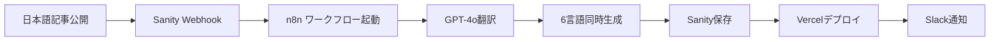

# 🌐 旅ログ多言語展開運用マニュアル

> **Phase 1実装完了** - 基幹7言語対応（ja, en, zh-CN, zh-TW, ko, th, vi）

## 📋 目次

1. [Phase別言語ロールアウト戦略](#phase別言語ロールアウト戦略)
2. [翻訳パイプライン運用](#翻訳パイプライン運用)
3. [品質管理・モニタリング](#品質管理モニタリング)
4. [トラブルシューティング](#トラブルシューティング)
5. [Phase 2/3 展開手順](#phase-23-展開手順)

---

## 🎯 Phase別言語ロールアウト戦略

### Phase 1: 基幹7言語 ✅ **実装完了**
- **言語**: ja, en, zh-cn, zh-tw, ko, th, vi
- **対象市場**: 日本・東アジア・東南アジア
- **実装状況**: 
  - ✅ Astro i18n設定完了
  - ✅ Sanity多言語スキーマ設定
  - ✅ 動的ルーティング (/[lang]/[type]/[slug])
  - ✅ hreflang自動生成
  - ✅ n8n翻訳パイプライン
  - ✅ RTLサポート（Phase 3準備）

### Phase 2: 拡張6言語 🔄 **準備中**
- **言語**: id, ms, tl, fr, de, es
- **対象市場**: 東南アジア・西欧
- **展開条件**: Phase 1でPV +30%, 直帰率 -15%

### Phase 3: 多様化7言語 ⏳ **計画中**
- **言語**: it, pt, ru, ar, hi, tr, pt-br
- **対象市場**: 新興市場・中東・南米
- **展開条件**: Phase 2でPV +20%, 直帰率 -10%

---

## 🔄 翻訳パイプライン運用

### 自動翻訳フロー



### 手動介入ポイント

1. **翻訳品質チェック** (週1回)
   ```bash
   # 最新翻訳記事の品質確認
   curl -s "https://my-sanity-site.vercel.app/api/recent-translations" | jq
   ```

2. **専門用語辞書更新** (月1回)
   - n8nワークフローのGPT-4プロンプト調整
   - 観光地名・料理名の固有名詞リスト更新

3. **翻訳コスト監視**
   - OpenAI API月次使用量: 目標 $50以下
   - トークン数制限: `原文 × 1.3` 厳守

### 成功・失敗通知

- **成功**: `#travel-blog-alerts` に翻訳完了通知
- **失敗**: `@channel` でエラーアラート + GitHub Issue自動作成

---

## 📊 品質管理・モニタリング

### KPI監視 (Googleアナリティクス)

| メトリクス | Phase 1目標 | 現在値 | 判定基準 |
|-----------|------------|--------|----------|
| 多言語PV比率 | 30% | - | 📈 +5%/月 |
| 言語別直帰率 | <60% | - | 📉 -2%/月 |
| セッション時間 | >2分 | - | 📈 +10秒/月 |
| CLS (多言語フォント) | <0.1 | - | ⚡ Lighthouse CI |

### SEO健全性チェック

```bash
# 週次実行スクリプト
./scripts/seo-health-check.sh

# チェック項目:
# - hreflang整合性
# - sitemap.xml各言語エントリ
# - 重複コンテンツ検知
# - Core Web Vitals (言語別)
```

### Lighthouse CI自動テスト

```yaml
# .github/workflows/lighthouse-ci.yml
# Phase 1: 7言語 × 2ページ = 14URL自動テスト
# スコア基準: Performance ≥85, SEO ≥90
# フォント読み込み最適化チェック
```

---

## 🚨 トラブルシューティング

### よくある問題と解決策

#### 1. 翻訳パイプライン失敗
```bash
# n8nワークフロー手動実行
curl -X POST "https://n8n.yourserver.com/webhook/travel-blog-translation" \
  -H "Content-Type: application/json" \
  -d '{"documentId": "article-id", "type": "article", "event": "create", "language": "ja"}'
```

#### 2. 特定言語のビルド失敗
```bash
# 言語別ビルドテスト
cd site
ASTRO_LANGUAGE_FILTER=en npm run build
```

#### 3. hreflang生成エラー
```bash
# サイトマップ手動再生成
cd site
npm run build
curl -s "https://my-sanity-site.vercel.app/sitemap-index.xml" | xmllint --format -
```

#### 4. RTL言語レイアウト崩れ
```css
/* RTLレイアウト確認 */
.rtl-layout {
  direction: rtl;
  text-align: right;
}
```

### エラー監視・アラート

- **Vercel関数エラー**: Slack `#dev-alerts` 即時通知
- **翻訳API障害**: n8n 3回リトライ → 手動介入要請
- **SEOスコア低下**: 週次レポートで閾値監視

---

## 🚀 Phase 2/3 展開手順

### Phase 2 展開条件チェック

```bash
# A/Bテスト結果評価 (3ヶ月後)
./scripts/phase-evaluation.sh --phase=1 --duration=3months

# 判定基準:
# ✅ PV +30% (多言語経由)
# ✅ 直帰率 -15% (Phase 1言語)
# ✅ 翻訳コスト <$50/月
# ✅ Lighthouse SEOスコア >90 (全言語)
```

### Phase 2 実装手順

1. **astro.config.mjs更新**
   ```javascript
   i18n: {
     locales: [
       // Phase 1
       'ja', 'en', 'zh-cn', 'zh-tw', 'ko', 'th', 'vi',
       // Phase 2 追加
       'id', 'ms', 'tl', 'fr', 'de', 'es'
     ]
   }
   ```

2. **i18n.ts言語有効化**
   ```typescript
   // Phase 2言語のenabled: true に変更
   {id: 'id', enabled: true, phase: 2},
   {id: 'ms', enabled: true, phase: 2},
   // ...
   ```

3. **n8nワークフロー更新**
   ```json
   "targetLanguages": [
     "en", "zh-cn", "zh-tw", "ko", "th", "vi",
     "id", "ms", "tl", "fr", "de", "es"
   ]
   ```

4. **デプロイ・テスト**
   ```bash
   npm run build && npm run preview
   ./scripts/e2e-test.js --phase=2
   ```

### Phase 3 特別要件

- **RTL言語対応**: アラビア語レイアウト最適化
- **複数文字セット**: ヒンディー語デーヴァナーガリー文字
- **地域バリアント**: ポルトガル語ブラジル (pt-BR)

---

## 📈 成功指標・KPI

### Phase別成功基準

| Phase | 期間 | PV増加率 | 直帰率改善 | 翻訳コスト | SEOスコア |
|-------|------|----------|------------|------------|-----------|
| Phase 1 | 3ヶ月 | +30% | -15% | <$50/月 | >90 |
| Phase 2 | 6ヶ月 | +20% | -10% | <$80/月 | >90 |
| Phase 3 | 12ヶ月 | +15% | -8% | <$120/月 | >90 |

### 長期ビジョン (12ヶ月後)

- **総PV**: 100万PV/月 (多言語寄与率60%)
- **総言語数**: 20言語完全対応
- **翻訳自動化率**: 95% (手動介入<5%)
- **SEO順位**: 主要キーワード上位10位 (言語別)

---

## 🛠️ 開発者向けメモ

### 新言語追加チェックリスト

- [ ] `sanity.config.js` supportedLanguages追加
- [ ] `i18n.ts` 言語定義・フォント設定
- [ ] `astro.config.mjs` locales配列追加
- [ ] n8nワークフロー targetLanguages更新
- [ ] Lighthouse CI テストURL追加
- [ ] UI_LABELS翻訳追加
- [ ] Google Fonts読み込み (必要に応じて)

### 緊急時連絡先

- **n8n障害**: [n8n.io Status](https://status.n8n.io/)
- **OpenAI API障害**: [OpenAI Status](https://status.openai.com/)
- **Vercel障害**: [Vercel Status](https://www.vercelstatus.com/)
- **Sanity障害**: [Sanity Status](https://status.sanity.io/)

---

**🎉 Phase 1完了！次はA/Bテスト結果を待ってPhase 2展開を検討しましょう。**